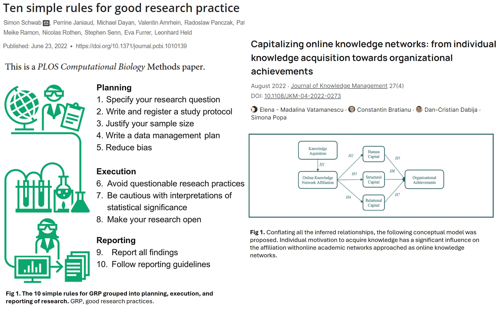
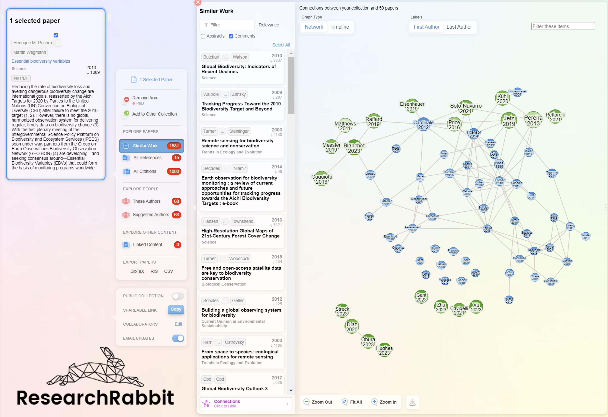

Tools to Help Productivity
================
This project describes a series of tools designed to improve academic
productivity, understood as the number of research results obtained
within a given time period.

- [Best Practices: Collaborative Knowledge
  Networks](#best-practices-collaborative-knowledge-networks)
- [Collaborative Development](#collaborative-development)
  - [Discussion and Collaboration
    Platforms](#discussion-and-collaboration-platforms)
    - [Impact of AI on These
      Platforms](#impact-of-ai-on-these-platforms)
      - [Stack Overflow AI \| Overflow
        AI](#stack-overflow-ai--overflow-ai)
      - [GitHub Copilot AI](#github-copilot-ai)
- [Literature Search](#literature-search)
  - [Academic Metasearch (eg. Google Scholar, Scopus, Web of
    Science)](#academic-metasearch-eg-google-scholar-scopus-web-of-science)
  - [Publish or perish](#publish-or-perish)
  - [Research Rabbit](#research-rabbit)
  - [ChatGPT and Plugins](#chatgpt-and-plugins)
  - [Scispace](#scispace)
  - [scite.ai](#sciteai)
- [Writing](#writing)
  - [Grammarly and LanguageTool](#grammarly-and-languagetool)
  - [ChatGPT and Microsoft Copilot](#chatgpt-and-microsoft-copilot)
    - [ChatGPT Advantages](#chatgpt-advantages)
    - [Microsoft Copilot Advantages](#microsoft-copilot-advantages)
  - [Obsidian](#obsidian)
- [APIs](#apis)
  - [References](#references)

## Best Practices: Collaborative Knowledge Networks

**Research best practices:** Actions and principles that ensure quality,
efficiency, and ethics in research.

- **Collaborative knowledge networks**: Teams of researchers, resources,
  and technology that actively collaborate to share information, solve
  problems, and generate collective knowledge.

- **Collaboration culture:** Promoting communication between researchers
  and teams, facilitating access and information exchange, and
  encouraging the flow of knowledge and feedback during research.



- **Collaborative documentation:** Record of progress, accessible to
  team members to use and provide feedback on relevant data and tools,
  speeding up workflows.

  - **Clarity and reproducibility:** Makes it easier to understand and
    replicate the research process (Behind the final product: research,
    preparation, code, discussions, knowledge).
  - **Avoids rework:** Recycling progress allows researchers to focus on
    analysis instead of repeated reviews. Even the author may have
    difficulty reproducing their own results when revisiting them.
  - **Real-time feedback:** Like peer reviews, good documentation
    facilitates access to information and dynamic review of scripts,
    progress, and presentations by other researchers.
  - **Researcher achievements:** Individual motivation and team
    participation optimize the use of human capital and promote the use
    of structural and relational capital.

- **Markdown to facilitate documentation:**

  - Markdown is a lightweight markup language that allows formatting
    text with an easy-to-read syntax and converting it to other formats
    (e.g., HTML or PDF).
  - .md files facilitate the structured writing of documentation and
    reproducibility of knowledge by linking calculation, output, and
    written analysis.

script example:

``` r
A<-1; B<-1
print("helloWorld")
```

```
## [1] "helloWorld"
```

``` r
A+B
```

```
## [1] 2
```

- GitHub automatically renders .md files in online repositories, showing
  the applied formatting (headings, lists, links, code, etc.), making
  versioned online reading and collaboration easier.

<span style="color: red;"> **This blog is an example of this! The
invitation is for us to provide collaborative feedback so it stays
updated and helps optimize processes among
researchers.**<span style="color: red;">

## Collaborative Development

Knowledge-sharing and problem-solving networks where people ask
questions, contribute, share ideas, solve challenges, and develop
projects, fostering open collaboration and information sharing (a record
is kept).

- **Task Search and Streamlining:**
  - Time spent searching: Looking for information, documentation, and
    help.
  - Streamlining repetitive tasks.
  - **Use of tools and platforms:** Facilitating discussions and
    knowledge exchange.

### Discussion and Collaboration Platforms

Researchers spend a significant amount of time searching the web for
software-related tasks, such as:

- - Recycling information.
  - Consulting documentation.
  - Seeking help with code errors and their solution.
  - Asking questions or proposing ideas for discussion.
  - Sharing findings and getting community feedback.
- There is a need to optimize these repetitive tasks, allowing
  researchers to focus on more relevant priorities.

Collaborative platforms are tools that offer web environments to manage
cloud content, facilitate discussions, exchange knowledge, and promote
discussions among researchers of different expertise levels.

<figure>

<figcaption aria-hidden="true">Graphical representation of the main
collaboration platforms. Some users actively participate while others
are just observers or “lurkers”.</figcaption>
</figure>

**Threaded discussion:** Hierarchical and navigable responses, with
version control and collaborative knowledge.

- - Posting and debating: Posting questions, sharing knowledge, and
    debating various topics.
  - Quick access to knowledge: Providing access to peers’ knowledge and
    experience.
  - Improved documentation: Suggestions and experiences to solve common
    problems.
  - Feedback: Discussion, optimization, and application in different
    contexts.
  - User guidance: Traceability and discussions available at any time.

Recycling experiences and processes helps improve productivity, as long
as the context of proposed solutions and ongoing research is understood.

- - Although all research questions are different, many steps are
    common.

  - Reducing search effort.

  - Increasing individual knowledge (as long as it is contrasted with
    other peer-reviewed sources).

  - Exchange and collaboration: Promoting best practices and
    collaboration.

  - Community building: Facilitating connection and collaboration for
    research.

  - <span style="color: red;"> **This knowledge should be used to
    support research (e.g., networking, discussing hypotheses, guiding
    ideas, reusing codes, adapting algorithms, etc.), but it should
    always be analyzed based on a solid knowledge base of the researcher
    (knows theoretically what they are doing and why they are doing
    it).**<span style="color: red;">

#### Impact of AI on These Platforms

AI has transformed collaborative tools.

- **Improved Productivity through AI:**
  - Reduces search time. Provides real-time suggestions. Optimizes
    problem-solving.


- **Impact on Researcher:**
  - Enables continuous progress in activities.
  - Reduces search time and frustration, improving emotional well-being.
  - Encourages critical thinking through real-time feedback.
  - Increases focus and motivation for more meaningful tasks.


With the growth of AI, the use of collaborative tools has changed
significantly:

- On the one hand, information on these platforms has been used to train
  AI models, improving the quality of automated responses.

<figure>

<figcaption aria-hidden="true">Common Crawl: Crawls all open access
content on the internet, including both relevant content (e.g.,
peer-reviewed) and low-quality content.</figcaption>
</figure>

- On the other hand, public queries have decreased as many users now
  consult AI systems directly to answer questions without interacting
  with the platforms.


- **The Dark Side of IA** <span style="color: red;">This information
  from forums and AI must be used carefully! Both questions and training
  datasets for AI are generated from a diverse range of examples (not
  always correct). It’s important to use these tools with judgment and
  context.<span style="color: red;">

  - Concerns about data privacy (e.g., surveillance, leaks).
  - User vulnerability: Responses (from moderators/developers) can
    influence users’ perception, attitude, and behavior.


- Increasing dependence on tools to perform activities.
- Reduction in human decision-making and creativity (decreased novelty).

 AI is advancing towards creating more
context-specific tools tailored to user needs:

##### Stack Overflow AI \| Overflow AI

- Summarizes multiple responses.
- Automated chat for code explanations.
- Provides real-time automatic answers that synthesize multiple
  responses based on context, tags, and relevant keywords.
- Prioritizes top-rated questions and answers, offering results based on
  quality and relevance.
- Integrates and searches responses from multiple information
  repositories.

<figure>

<figcaption aria-hidden="true"><a
href="https://stackoverflow.co/teams/ai/?utm_source=adwords&amp;utm_medium=ppc&amp;utm_campaign=teams_search_brand_ai&amp;_bt=689119161077&amp;_bk=overflow+ai&amp;_bm=p&amp;_bn=g&amp;gad_source=1&amp;gclid=CjwKCAjw3624BhBAEiwAkxgTOnFhWTa86KLIaXn2_Pji05apcRquOgXDIS8MK9ANRF9zKKk59-tT8hoC-fMQAvD_BwE">Official
Documentation Stack Overflow AI | Overflow AI. September
2024</a></figcaption>
</figure>

##### GitHub Copilot AI

- Suggests code snippets, autocompletion, and optimization in real-time.
- Suggests automatic comments for documentation.
- Real-time chat for coding help.
- Creates and manages documentation collections (custom training as
  context).

<figure>

<figcaption aria-hidden="true"><a
href="https://github.blog/2022-09-07-research-quantifying-github-copilots-impact-on-developer-productivity-and-happiness/">Official
GitHub Docs. Research: quantifying GitHub Copilot’s impact on developer
productivity and happiness. September 2024</a></figcaption>
</figure>

## Literature Search

### Academic Metasearch (eg. Google Scholar, Scopus, Web of Science)

- **Search and Retrieval:** Efficiently find, retrieve, and analyze
  academic literature.
- **Alert Subscriptions:** Receive notifications about new articles,
  topics, and authors of interest, helping to stay updated in the field.

### Publish or perish

- **Quick Literature Search:** Searches, retrieves, and provides access
  links to articles using multiple metasearch engines.
- **Impact Evaluation:** Uses databases like Google Scholar to extract
  citations and evaluate the impact of individual publications using
  bibliometric indicators (citations, ranking, authors, h-index).

<figure>

<figcaption aria-hidden="true"><a
href="https://harzing.com/resources/publish-or-perish">Interface of
Harzing’s Publish or Perish Software. September 2024</a></figcaption>
</figure>

### Research Rabbit

- **Interactive Exploration of Article Networks:** Provides a visual
  representation of connections between articles and authors (based on
  references).
- **Content-Based Recommendations:** Suggests related articles, based on
  thematic patterns and shared citations (Zotero plugin).
- **Follow Authors and Topics:** Notifications of new relevant
  publications with specific authors and topics.

<figure>

<figcaption aria-hidden="true"><a
href="https://www.researchrabbit.ai/">Interface of Research Rabbit
platform. September 2024</a></figcaption>
</figure>

### ChatGPT and Plugins

- **Literature Search:** Searches on the web or directly in article
  databases (Scholar GPT, Scispace).
- **Article Interaction:** Automatically summarizes articles and answers
  specific questions about the content (eg. Chat and ask with Document).
- **Unlimited Plugins** (including subscription without extra charge,
  like DALL-E, Scispace, etc.).

<figure>

<figcaption aria-hidden="true"><a href="https://chatgpt.com/">Interface
of ChatGPT plugins. OpenAI. September 2024</a></figcaption>
</figure>

### Scispace

- **Automated Search:** Finds peer-reviewed literature based on specific
  questions, tabulating perspectives and discussions from each article
  on that idea.
- **Tabular Section Summaries:** Generates summaries of sections of
  articles (e.g., introduction, methods, results, limitations).
- **Automated Responses:** Scispace Copilot provides answers to
  questions related to the search (PDF chat, concepts, paraphraser).

<figure>

<figcaption aria-hidden="true"><a href="https://typeset.io/">Interface
of sciSpace. September 2024</a></figcaption>
</figure>

### scite.ai

- **Automated Responses:** Provides real-time responses supported by
  peer-reviewed literature.
- **Contextual Search:** Lists article segments that refer to the
  searched topic, indicating if they support, contrast, or simply
  mention the work.
- **Smart Citations:** Shows the fragments of articles where a work is
  cited.

<figure>

<figcaption aria-hidden="true"><a
href="https://www.googleadservices.com/pagead/aclk?sa=L&amp;ai=DChcSEwitpJ6TvIyJAxVASkcBHdC1CNgYABAAGgJxdQ&amp;co=1&amp;ase=2&amp;gclid=CjwKCAjw3624BhBAEiwAkxgTOmrPr6s0gQ0LkVK5IoP2VcjPmCqxWePctlzRG2o2USt8uGjWF_qEMxoCED8QAvD_BwE&amp;ei=RlIMZ6iKB_-v5NoP4rKH0Qk&amp;ohost=www.google.com&amp;cid=CAESVuD2AuZjDEJZG12mVYyy-elmNfb1vVwcF_f4tvGE2-CdBLe8-oLoAxAulP6nR4iyt9JHZ_jMAqNnXDFRG_WlkarHvPJ5v4Jd9tc6ky-aoGGL4Y4g99XN&amp;sig=AOD64_3BN9Sj6C_OZJZmA3FYTO_FHmV4qw&amp;q&amp;sqi=2&amp;nis=4&amp;adurl&amp;ved=2ahUKEwioxZmTvIyJAxX_F1kFHWLZIZoQ0Qx6BAgIEAE">Interface
of Scite: AI for Research. September 2024</a></figcaption>
</figure>

## Writing

### Grammarly and LanguageTool

- Help with writing by providing grammar and style corrections and
  offering suggestions to improve clarity and coherence in multiple
  languages.

### ChatGPT and Microsoft Copilot

- **Overcome Creative Block:** Provide suggestions and generate initial
  ideas to start the writing process.
- **Organize Ideas:** Help organize ideas by grouping them by similar
  themes.
- **Automated Suggestions:** Provide phrases and structures to improve
  the clarity and coherence of academic texts.
- **Grammar and Style Check:** Include paraphrasing and text
  simplification options for greater clarity.

#### ChatGPT Advantages

- **Extension through Plugins:** Integration with other writing AIs to
  expand its features.
- **Custom Training:** Create GPTs trained with your own information.
- **Canvas Board for Editing:** Interactive tool for direct real-time
  text editing.

<figure>

<figcaption aria-hidden="true"><a href="https://chatgpt.com/">Interface
of ChatGPT 4o with Canvas. OpenAI . October 2024</a></figcaption>
</figure>

#### Microsoft Copilot Advantages

- **Integration with Microsoft:** Assistance in Word, data analysis in
  Excel, and writing in Outlook.
- **Intelligent Autocompletion:** Completes sentences and paragraphs
  based on the document’s context.

<figure>

<figcaption aria-hidden="true"><a
href="https://support.microsoft.com/en-us/windows/welcome-to-copilot-on-windows-675708af-8c16-4675-afeb-85a5a476ccb0">Copilot
on Windows. September 2024</a></figcaption>
</figure>

### Obsidian

A note-taking system with interconnected notes through bidirectional
links, making it easier to organize and discover relationships between
ideas

- **Markdown Editing:** Uses Markdown for quick and easy editing.
- **Advanced Search:** Allows searching within note collections.
- **Connection Plugins:** Integration with Word and Zotero for
  note-taking.

<figure>

<figcaption aria-hidden="true">Example of note integration between
Obsidian and Zotero. September 2024</figcaption>
</figure>

## APIs

APIs (Application Programming Interfaces) are sets of protocols that act
as bridges allowing applications to communicate with each other. APIs
enable service integration and task automation in research without
needing to download large datasets, only the necessary ones.

- [IUCN](https://apiv3.iucnredlist.org/)
  ([rredlist](https://cran.r-project.org/web/packages/rredlist/index.html)):
  Provides access to all data on species profiles from the IUCN Red List
  of Threatened Species (threat category, taxonomy, threats, geographic
  range).

- [GBIF](https://techdocs.gbif.org/en/openapi/)
  ([rgbif](https://cran.r-project.org/package=rgbif)): Offers access to
  the GBIF database for downloading records based on DarwinCore format
  info and spatial vectors.

- [STAC (Spatio Temporal Asset Catalogs)](https://stacspec.org/): Allows
  access and downloading of geospatial data catalogs within spatial and
  temporal study windows.

<figure>

<figcaption aria-hidden="true">Data Loading for Potential Covariates via
STAC Catalog. Adapted from (<a href="https://stacspec.org/en">STACSPEC,
2023</a>).</figcaption>
</figure>

<span style="color: blue;"> **Surely, many tools are missing from this
presentation. If you have any feedback or additional ideas for updating
it, feel free to create a branch and share your thoughts! Let’s
collaborate to keep improving it as part of our knowledge network and
boost our productivity.**<span style="color: blue;">

### References

- Barari, M., Casper Ferm, L.-E., Quach, S., Thaichon, P., and Ngo, L.
  (2024). The dark side of artificial intelligence in marketing:
  meta-analytics review. MIP 42, 1234–1256. doi:
  10.1108/MIP-09-2023-0494
- Brown, T. B., Mann, B., Ryder, N., Subbiah, M., Kaplan, J., Dhariwal,
  P., et al. (2020). Language Models are Few-Shot Learners. Available
  at: <http://arxiv.org/abs/2005.14165> (Accessed October 12, 2024).
- Del Rio-Chanona, R. M., Laurentsyeva, N., and Wachs, J. (2024). Large
  language models reduce public knowledge sharing on online Q&A
  platforms. PNAS Nexus 3, pgae400. doi: 10.1093/pnasnexus/pgae400
- Doshi, A. R., and Hauser, O. P. (2024). Generative AI enhances
  individual creativity but reduces the collective diversity of novel
  content. Sci. Adv. 10, eadn5290. doi: 10.1126/sciadv.adn5290
- Mostafapour, M., Fortier, J. H., Pacheco, K., Murray, H., and
  Garber, G. (2024). Evaluating Literature Reviews Conducted by Humans
  Versus ChatGPT: Comparative Study. JMIR AI 3, e56537. doi:
  10.2196/56537
- Noy, S., and Zhang, W. (2023). Experimental evidence on the
  productivity effects of generative artificial intelligence.
